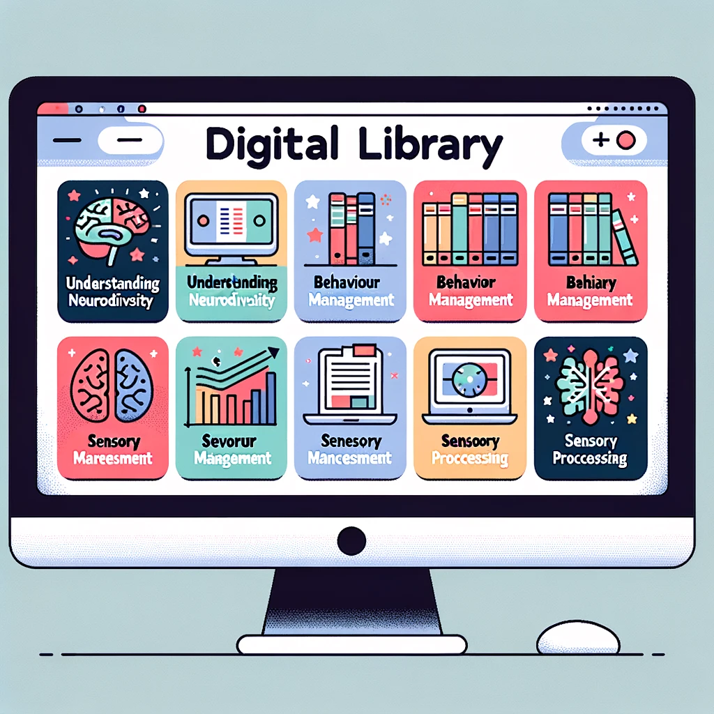

# Our Services

At Rethink Neuro, we specialise in providing guidance and support to families of neurodiverse children. Our team of experts is dedicated to helping families navigate the unique challenges that neurodiverse children may face, and to supporting each child's growth and development.

Our services include:

## One-on-One Coaching

Our one-on-one coaching services provide personalised coaching with our team of experts, who will work with families to develop the skills and strategies they need to support their neurodiverse child. We tailor our coaching to each family's unique needs and goals, providing ongoing support and guidance to help each child reach their full potential.

## Workshops and Training

We offer educational workshops and training sessions for parents, educators, and other professionals who work with neurodiverse individuals. Our workshops cover a range of topics, from understanding neurodiversity to developing effective communication and behavioural strategies.

## Resource Library

Our resource library is a collection of articles, blog posts, and other resources that provide guidance and support for neurodiverse families. It includes a range of topics, such as early intervention, behaviour management, and sensory processing, and is regularly updated to ensure that families have access to the latest information and research.

At Rethink Neuro, we are committed to helping each child reach their full potential. If you have any questions or would like to learn more about our services, please don't hesitate to [contact us](/contact/).

We look forward to working with you and your family.
